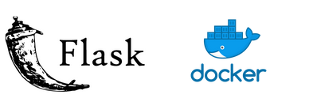

Aavail time series revenue prediction
=====================================

Installing
-----------

.. code-block:: bash

    ~$ git clone https://github.com/williammaiaarruda/IBM_AI_WORKFLOW.git
    
    ~$ pip install -r requirements.txt
    

To run app.py
---------------------

.. code-block:: bash

    ~$ python app.py

or to start the flask app in debug mode

.. code-block:: bash

    ~$ python app.py -d

Predict Endpoint
-----------------
http://localhost:8080/predict

Train Endpoint
-----------------
http://localhost:8080/train

Logs Endpoint
-----------------
These are the links to access the API logs

http://localhost:8080/logs/train-test.log

The logs files are in the logs folder

Go to http://localhost:8080/ and you will see a basic website that can be customized for a project.

Monitoring
-----------
The monitoring folder contains the files used by the monitoring script

You can access the API EndPoints using curl command in a terminal
------------------------------------------------------------------

Train EndPoint
--------------

.. code-block:: bash

    Test Mode (Trains only two models)

    ~$ curl --header "Content-Type: application/json" --request POST --data '{"mode":"test"}'  http://localhost:8080/train

    Full Mode (Trains all models)

    ~$ curl --header "Content-Type: application/json" --request POST --data '{"mode":"full"}'  http://localhost:8080/train

Predict EndPoint
-----------------
.. code-block:: bash

    ~$ curl --header "Content-Type: application/json" --request POST --data '{"country": "all","year": "2019","month": "11","day": "30"}' http://localhost:8080/predict

To run the model directly
----------------------------

see the code at the bottom of `model.py`

.. code-block:: bash

    ~$ python model.py

Run the unittests
-------------------

Before running the unit tests launch the `app.py`.

.. code-block:: bash

    ~$ python app.py

To run only the api tests

.. code-block:: bash

    ~$ python unittests/ApiTests.py

To run only the model tests

.. code-block:: bash

    ~$ python unittests/ModelTests.py

To run all of the tests

.. code-block:: bash

    ~$ python run-tests.py

To build the docker container
--------------------------------

.. code-block:: bash

    ~$ docker build -t aavail-ml .

Check that the image is there.

.. code-block:: bash

    ~$ docker image ls

You may notice images that you no longer use. You may delete them with

.. code-block:: bash

    ~$ docker image rm IMAGE_ID_OR_NAME

And every once and a while if you want clean up you can

.. code-block:: bash

    ~$ docker system prune

Run the container to test that it is working
----------------------------------------------    

.. code-block:: bash

    ~$ docker run -p 4000:8080 aavail-ml

Go to http://localhost:4000/ and you will see a basic website that can be customized for a project.

